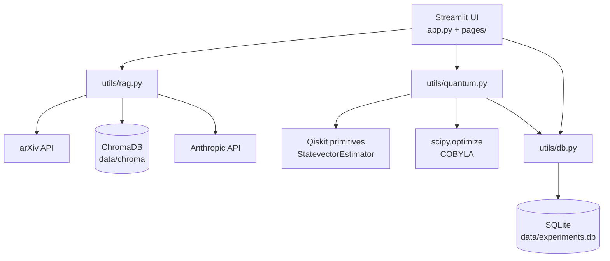

# Quantum R&D Tool

[](https://github.com/s-kubori/quantum-rd-tool/actions/workflows/ci.yml)

A Streamlit application that supports quantum chemistry research by combining
literature retrieval with quantum simulation. It pulls paper abstracts from arXiv
into a persistent vector store, answers questions against that store with Claude,
runs VQE to estimate the ground state energy of the hydrogen molecule, and keeps
a log of past runs.

Built as a practical exercise in taking a working prototype and giving it the
things a prototype usually lacks: pinned dependencies, tests, a container image,
and a CI pipeline that verifies all of it.

## Features

### RAG Paper Search

Fetches papers from arXiv for a given query and stores their titles and abstracts
in ChromaDB as embeddings. Asking a question embeds the question too, retrieves
the three closest entries, and passes them to Claude as context. The answer is
shown alongside the titles it drew on.

Two things are worth knowing about how this behaves:

- **Only abstracts are indexed.** Full texts are never downloaded, so questions
  about methodology or results beyond what an abstract states cannot be answered
  from the source material.
- **The store is cumulative.** Papers accumulate across queries and persist in
  `data/chroma` between sessions. A question is matched against everything
  collected so far, not just the most recent fetch — and since the retrieval has
  no distance cutoff, three entries always come back as long as the store is
  non-empty, relevant or not.

### Quantum Computation

Builds a variational ansatz for a two-qubit H2 Hamiltonian and minimises its
energy expectation value with COBYLA, iterating up to 200 times. The quantum side
evaluates the energy for a given set of circuit parameters; the classical
optimiser decides which parameters to try next. Results converge to roughly
-1.857 Ha.

Each run is written to the experiment log, and the energy at each iteration is
plotted as a convergence curve.

### Experiment Log

Lists past runs from SQLite — parameters, resulting energy, iteration count, and
convergence status — with the full parameter and result payloads viewable per
run.

## Architecture



The three `utils` modules are independent of Streamlit and hold all the logic;
the pages are thin. That split is what makes the test suite possible — the tests
exercise `db.py` and `quantum.py` directly without starting a server.

## Getting started

### Prerequisites

- Python 3.12 for a local run (the container and CI both use 3.12; newer versions
  may not yet have wheels for the scientific stack), or Docker
- An Anthropic API key, for the RAG page

### Local

```bash
git clone https://github.com/s-kubori/quantum-rd-tool.git
cd quantum-rd-tool

python -m venv venv
source venv/bin/activate        # Windows (PowerShell): venv\Scripts\activate
                                # Windows (Git Bash):   source venv/Scripts/activate
pip install -r requirements.txt

cp .env.example .env            # then fill in ANTHROPIC_API_KEY
streamlit run app.py
```

The app is served at http://localhost:8501.

`ANTHROPIC_MODEL` is optional; the code falls back to a default if it is unset.
Setting it explicitly is recommended, since model names are retired over time.

### Docker

```bash
docker build -t quantum-rd-tool .
docker run -p 8501:8501 --env-file .env quantum-rd-tool
```

The image does not bake in `.env` — credentials are injected at runtime.

Data written to `/app/data` (the SQLite database and the Chroma store) lives
inside the container and is lost when it is removed. Mount a volume to keep it:

```bash
docker run -p 8501:8501 --env-file .env -v "$(pwd)/data:/app/data" quantum-rd-tool
```

## Running tests

```bash
pip install -r requirements-dev.txt
pytest -v
```

Ten tests covering the SQLite layer and the VQE path. `tests/conftest.py`
provides a `temp_db` fixture that redirects `db.DB_PATH` to a throwaway file, so
tests never touch `data/experiments.db`.

## CI/CD

`.github/workflows/ci.yml` runs two jobs in parallel on every push to `main` and
every pull request.

**`pytest`** — sets up Python 3.12 and runs the test suite.

**`docker build & smoke test`** — builds the image with layer caching, starts a
container, and polls `/_stcore/health` for up to 60 seconds. On failure it dumps
the container logs before cleaning up.

The second job exists because a successful build says nothing about whether the
image actually starts: `CMD` is not executed at build time, so an image can build
cleanly and still fail on launch. The smoke test closes that gap.

`main` is protected — both checks must pass before a pull request can be merged,
and direct pushes are rejected.

## Design notes

### CPU-only torch

`sentence-transformers` depends on `torch`, and the default PyPI wheel bundles
roughly 4 GB of CUDA runtime that a container with no GPU will never use.
Installing from the CPU index instead cut the image from 9.56 GB to 3.02 GB
(653 MB compressed) and the build from ~11 minutes to ~4.

### Layer ordering

Dependencies are installed before application code is copied, and CPU torch is
installed in its own layer ahead of `requirements.txt`. The effect is visible in
CI: a change to `requirements.txt` re-runs the pip layer (~49 s) but restores
torch from cache (~13 s), and a change to Python code alone leaves both layers
`CACHED`, taking the whole job from about four minutes to under two.

### Paths resolved against the project root

`db.py` and `rag.py` resolve `data/` from `Path(__file__).resolve().parent.parent`
rather than from a relative `./data`, so the application reads and writes the
same directory regardless of the working directory it was launched from.

### Pinned dependencies

Every package in `requirements.txt` is pinned to an exact version. `scipy` is
listed explicitly even though five other packages pull it in transitively —
`utils/quantum.py` imports it directly, and relying on someone else's dependency
graph to satisfy that is not a guarantee.

Test-only packages live in `requirements-dev.txt` so they stay out of the runtime
image.

### Secrets stay out of the image

`.dockerignore` excludes `.env`, so credentials are never baked into a layer.
They are injected at runtime instead, via `--env-file` or `-e`. This was verified
during the initial container run: the RAG page returned an authentication error,
which was the expected result — it confirmed the key had not travelled with the
image.

The same run also showed an empty experiment log, confirming that the local
SQLite database had not been copied in either.

### The model name is configuration, not code

`utils/rag.py` reads the Claude model from `ANTHROPIC_MODEL` rather than holding
a literal. The project sat untouched for four months and came back broken — not
because a dependency had moved, but because the hardcoded model had been retired
and the API returned 404. External services change on their own schedule, and
anything that names one belongs in configuration.

### Tests surface what a running app hides

The test suite was added to catch regressions, but its first real find was a
`DeprecationWarning`: the Qiskit `TwoLocal` class used to build the ansatz is
scheduled for removal in Qiskit 3.0. Nothing was broken, and clicking through the
app would never have shown it — pytest surfaces warnings that a Streamlit session
swallows.

The same suite is what made the `pathlib` refactor safe to do, and it caught a
type mismatch in its own fixture along the way.

## Project structure

```
.
├── app.py                     # Landing page
├── pages/
│   ├── 1_RAG_Search.py
│   ├── 2_Quantum_Computation.py
│   └── 3_Experiment_Log.py
├── utils/
│   ├── db.py                  # SQLite persistence
│   ├── quantum.py             # H2 Hamiltonian, ansatz, VQE
│   └── rag.py                 # arXiv, ChromaDB, Claude
├── tests/
│   ├── conftest.py
│   ├── test_db.py
│   └── test_quantum.py
├── .github/workflows/ci.yml
├── Dockerfile
├── requirements.txt
├── requirements-dev.txt
└── pytest.ini
```

## License

MIT — see [LICENSE](LICENSE).
